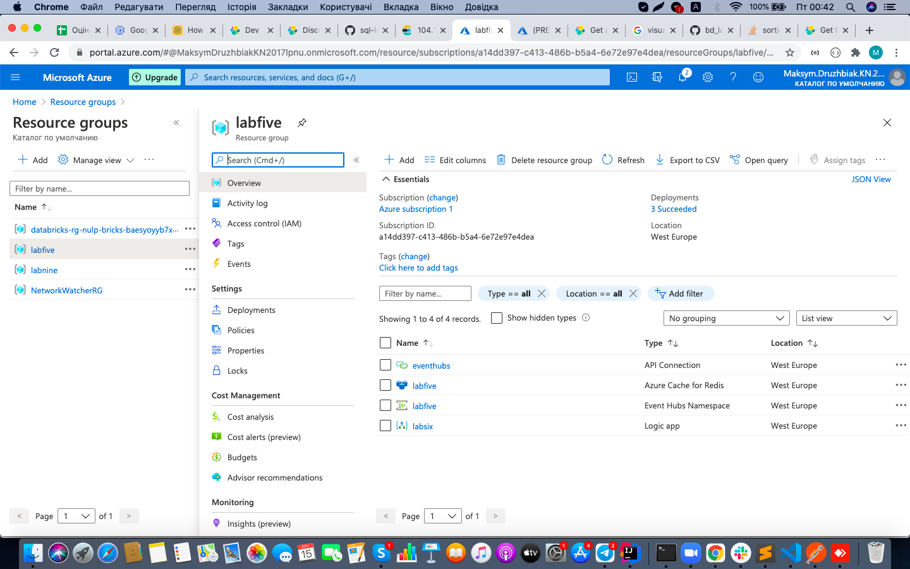
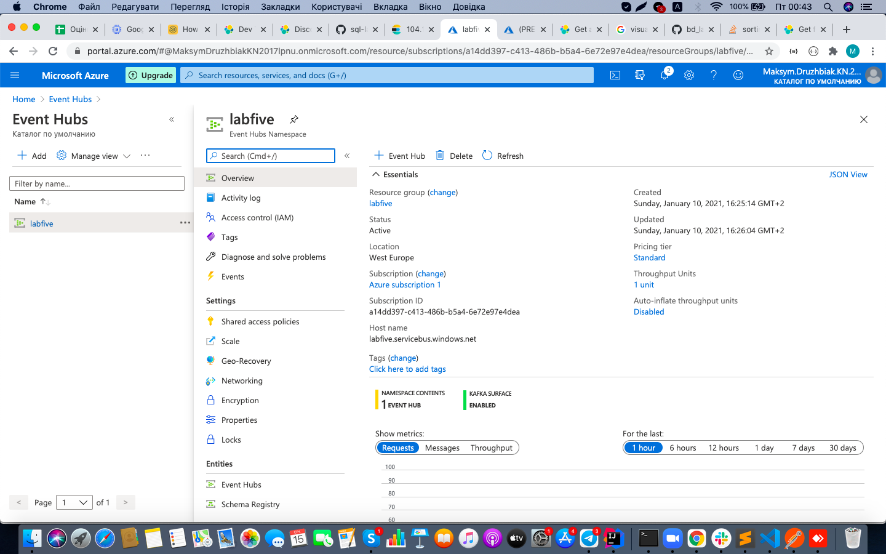
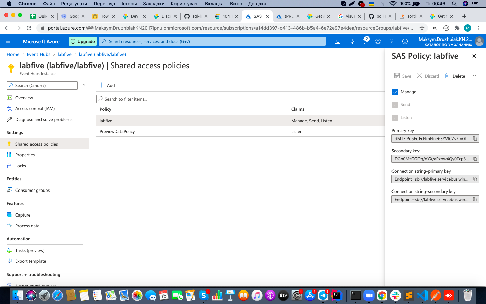
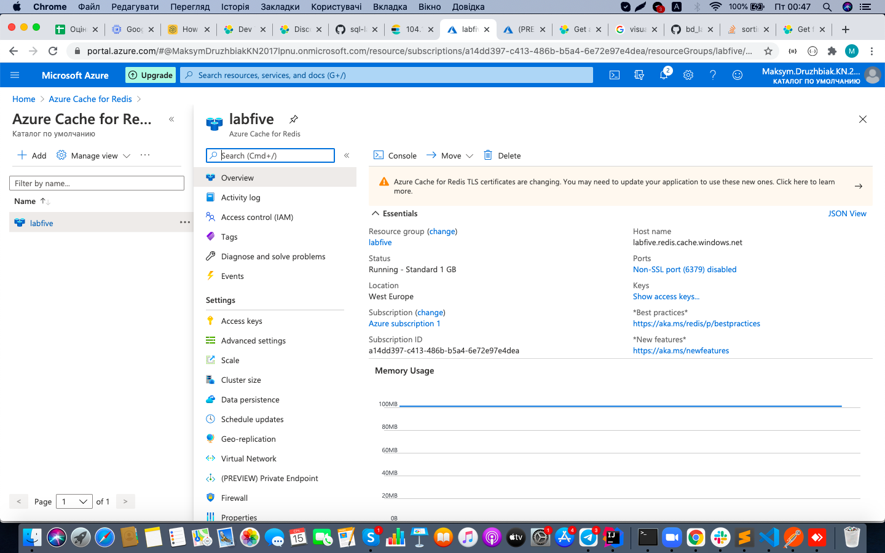
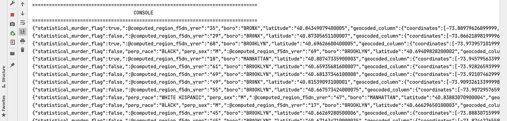
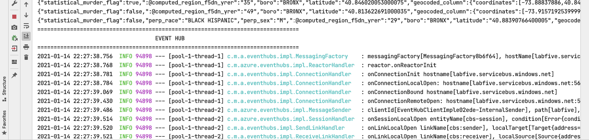
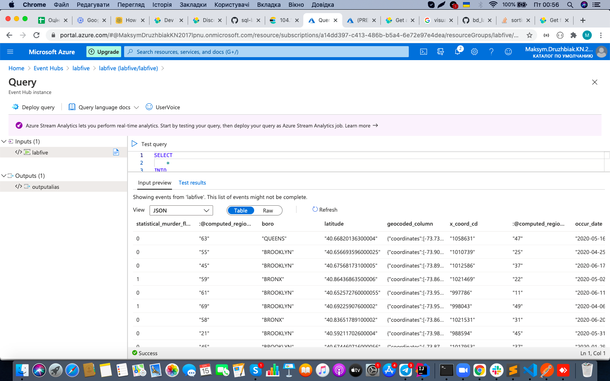
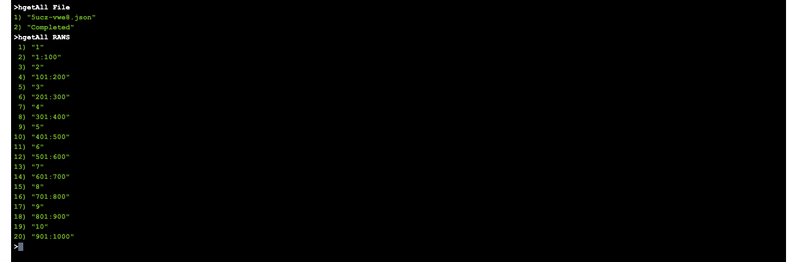

# lab 5

1. Створив ресурсну групу на Azure.

2. Створив Event Hub та його entity.

3. Додав та налаштував відповідний Shared Access Policy.

4. Створив новий інстанс Azure Cache for Redis.

5. Запустив код. Принцип його роботи наступний: спочатку відбувається запис даних в консоль, коли відбувся запис половини усіх об'єктів, відбувається запис безпосередньо в Event Hub. Для запису даних скористався аплікацією Postman: метод GET на localhos:8080/url.

6. Для перевірки перейшов в Event Hub та подивися на запис даних. Для цього використав Process data для інстанса Event Hub.

7. А також перевірив запис даних у редісі.

