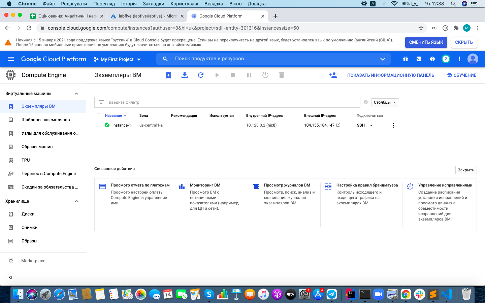
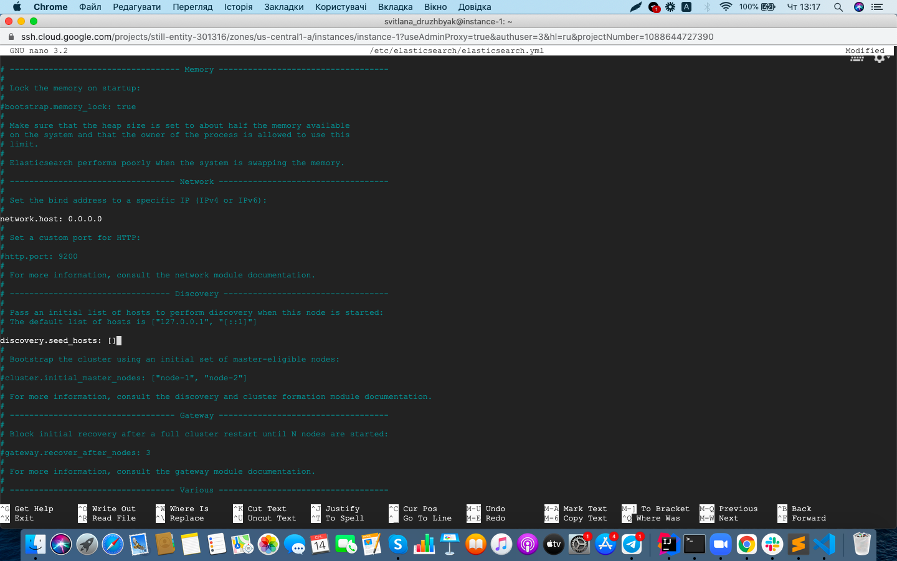
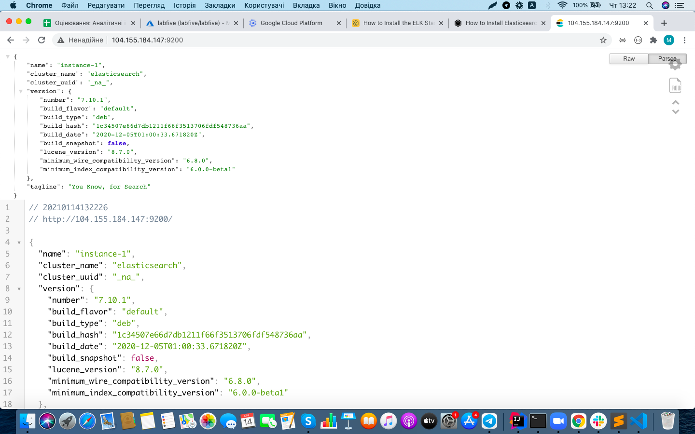
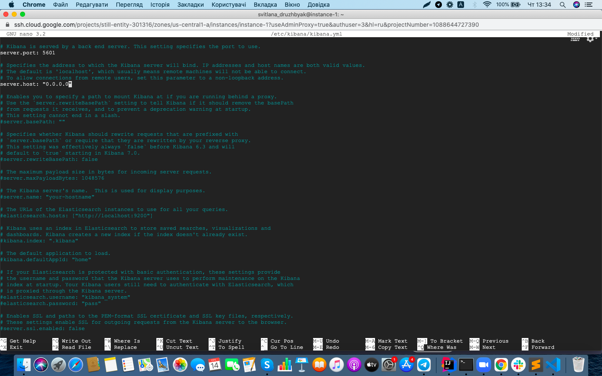
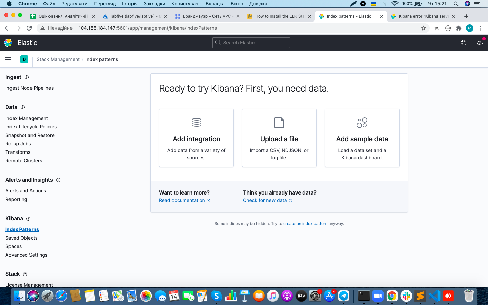
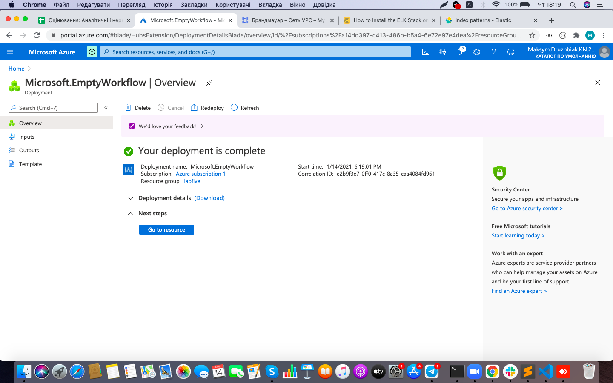
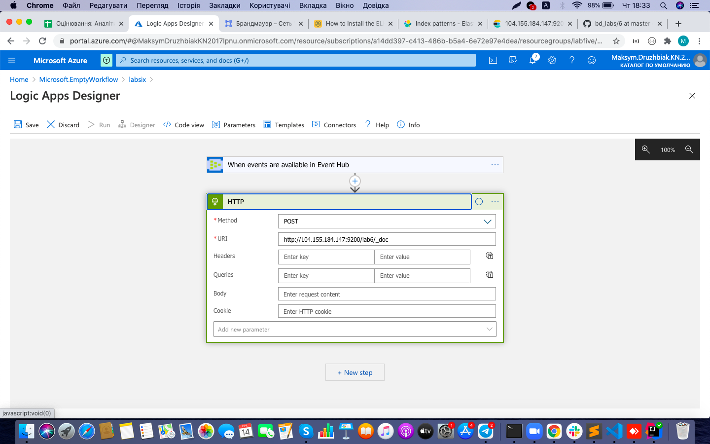
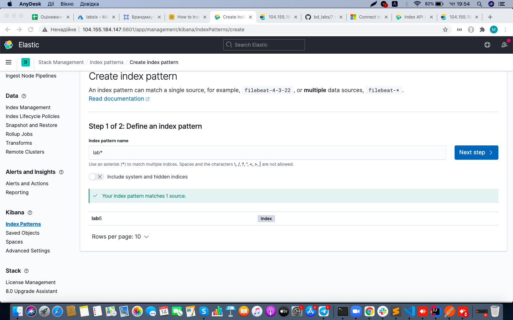
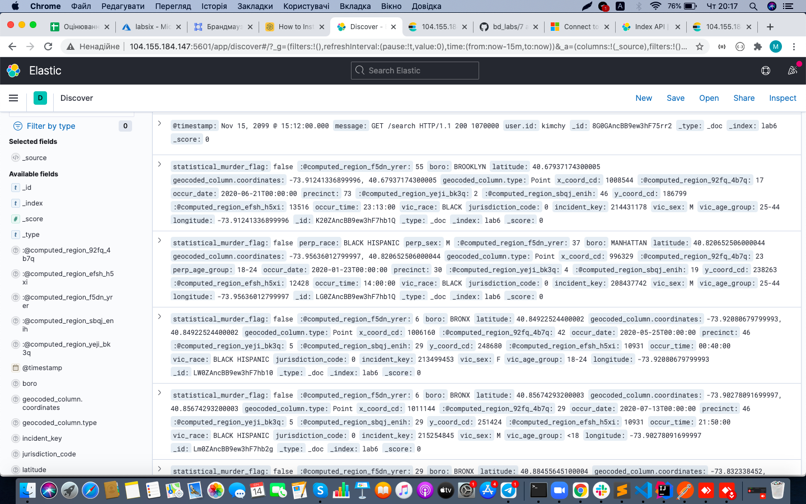

# lab 6

1. Створив новий екземпляр Compute Engine на GCP. Операційна система Ubuntu, дозволив трафік HTTP/HTTPS.

2. Створив нове правило брандмауера elastic: увімкнув журнали, вибрав цільовими екземплярами всі екземпляри в мережі, задав діапазони IP адрес джерел 0.0.0./0, додав протокол tcp 9200

3. Створив ще одне правило брандмауера kibana: повторив усі попередні кроки, змінив протокол tcp на 5601.

4. Повернувся до інстанс Compute Engine, виконав наступні команди:
	1) sudo apt-get install default-jre
	2) sudo apt update
	3) sudo apt install apt-transport-https
	4) java -version
	5) wget -qO - https://artifacts.elastic.co/GPG-KEY-elasticsearch | sudo apt-key add -
	6) sudo sh -c 'echo "deb https://artifacts.elastic.co/packages/7.x/apt stable main" > /etc/apt/sources.list.d/elastic-7.x.list'
	7) sudo apt update
	8) sudo apt install elasticsearch
На цьому етапі успішно був встановлений elasticsearch
	9) sudo nano /etc/elasticsearch/elasticsearch.yml
У цьому файлі змінив network host та discovery seed hosts відповідним чином.

	10) sudo service elasticsearch restart
5. Відкрив у браузері відповідний JSON об'єкт.

6. Виконав наступні команди для інсталяції Logstash
	1) sudo apt-get install apt-transport-https
	2) echo "deb https://artifacts.elastic.co/packages/5.x/apt stable main" | sudo tee -a /etc/apt/sources.list.d/elastic-5.x.list
	3) sudo apt-get update
	4) sudo apt-get install logstash
	5) sudo service logstash start
На даному етапі Logstash успішно встановлений та запущений.
7. Встановив kibana, виконуючи наступні команди:
	1) echo "deb http://packages.elastic.co/kibana/5.3/debian stable main" | sudo tee -a /etc/apt/sources.list.d/kibana-5.3.x.list
	2) sudo apt-get update
	3) sudo apt-get install kibana
	4) sudo nano /etc/kibana/kibana.yml
У файлі розкоментував server port та змінив server host на 0.0.0.0

	5) sudo service kibana restart
На цьому етапі kibana успішно встановлена та запущена.

8. В Azure створив Logic app.

9. В Logic Apps Designer створив наступний шаблон. Початковий тригер - When events are available in Event Hub, наступний крок - HTTP запит.

