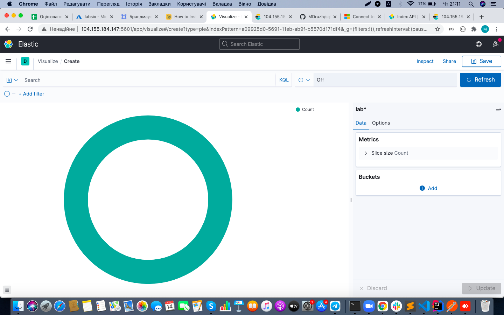
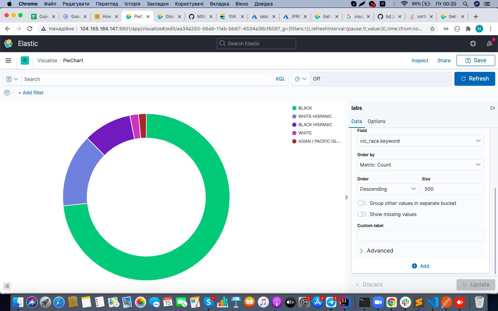
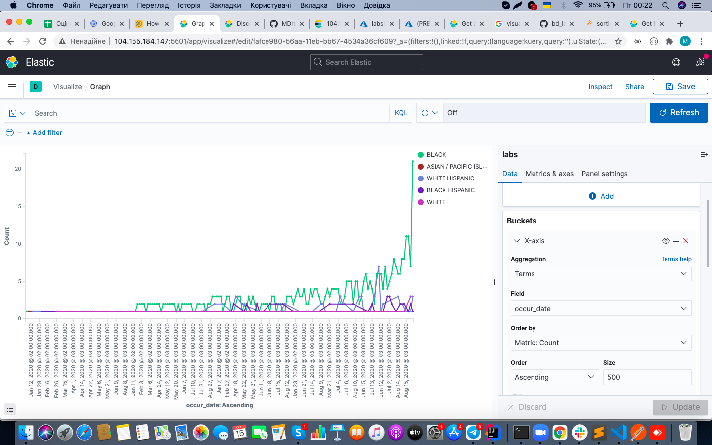
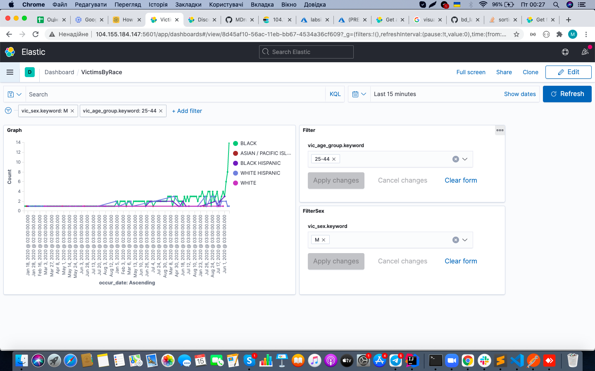
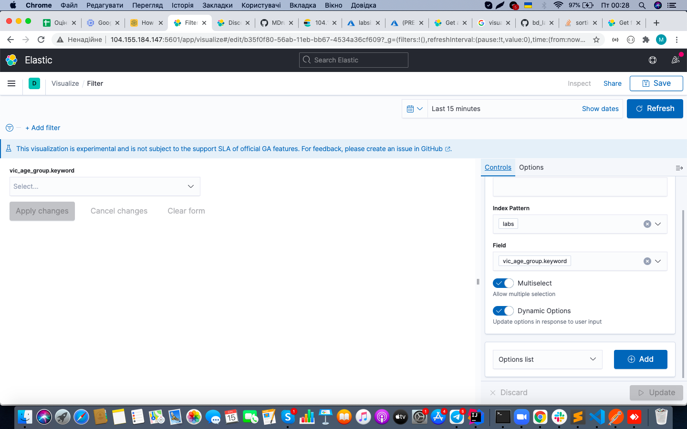
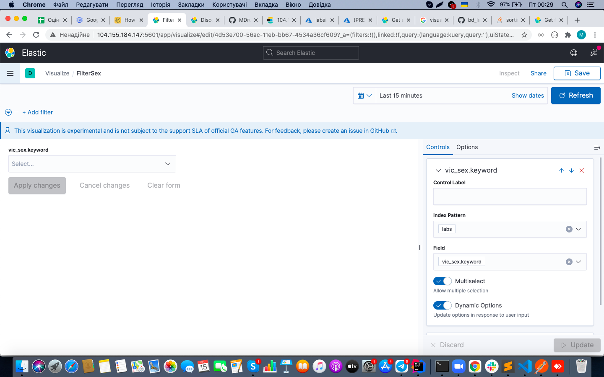
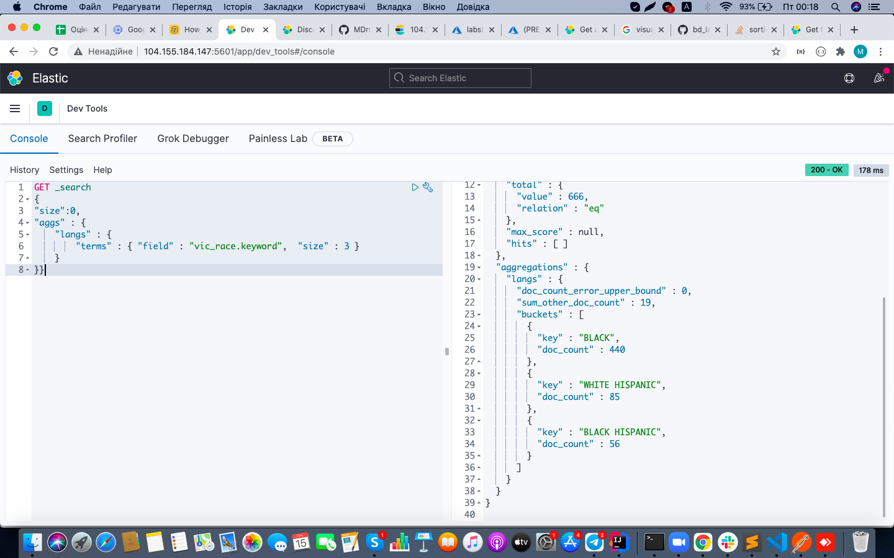
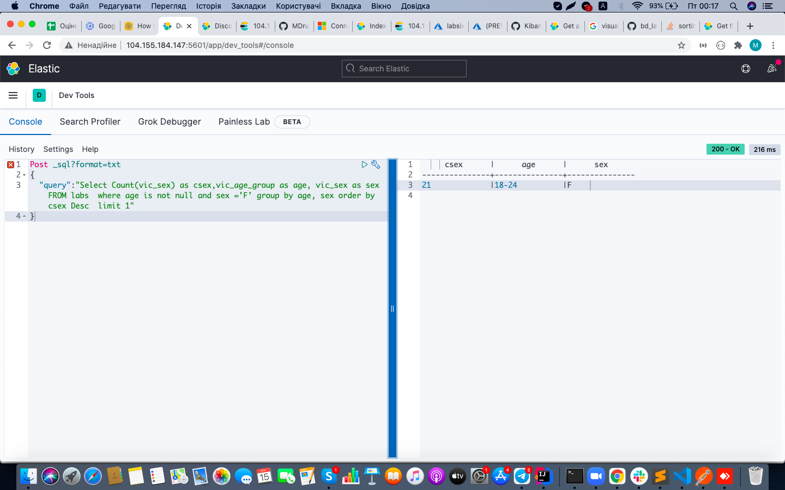

# lab 7

1. У розділі Visualize створив Pie Chart.

2. Додав до пайчарту Bucket з інформацією щодо victim's races з наступними налаштуваннями:
	Aggregation: Terms,
	Field: vic_race.keyword,
	Size: 500

3. Створив візуалізацію типу Line з об'єднаними даними по даті та расі. Створив два бакети та додав туди необхідні параметри.

4. У дашборді додав 2 фільтри (вік та стать) до попередньої візуалізації.

Фільтр по вікових категоріях:

Фільтр по статі:

5. У devTools сформував топ-3 записи за полем victim's race. Використав наступний код:

GET _search
{
"size":0,
"aggs" : {
    "langs" : {
        "terms" : { "field" : "vic_race.keyword",  "size" : 3 }
    }
}}

6. І сформував список з найбільшою кількістю записів за допомогою наступного коду:

Post _sql?format=txt
{
  "query":"Select Count(vic_sex) as csex,vic_age_group as age, vic_sex as sex FROM labs  where age is not null and sex ='F' group by age, sex order by csex Desc  limit 1" 
}

