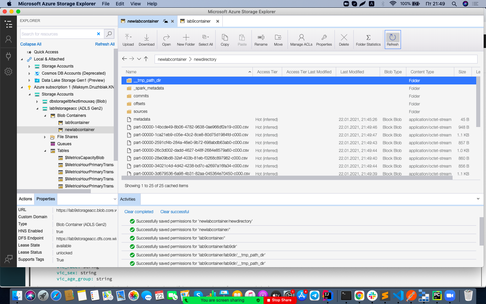

# Labs 8/9
1. Створив нову Resource group та Azure Databricks.

2. Створив Storage account. В Advanced налаштуваннях дозволив Hierarchical namespace.

3. Створив контейнер всередирі Storage account.

4. Створив директорію всередині контейнеру.

5. Всередині воркспейсу Azure Databricks створив кластер.

6. Створив нову App registration в Azure Active Directory.

7. Додав новий client secret.
8. Налаштував доступ у сторедж акаунті у розділі Access Control (IAM).

9. Всередині кластеру інсталював необхідну бібліотеку.

10. Створив 2 ноутбуки в Azure Databricks, на пайтоні та скалі відповідно.

11. У ноутбук з пайтоном вставив наступний код для конфігурації (pynotebook.py) . Усі необхідні ключі потрібно взяти із власної App registation. 
12. Встановив аплікацію Azure Storage Explorer.
13. Налаштував доступ до створеної раніше директорії.

14. Для скали ноутбука вставив наступний код (scalanotebook).
15. Після виконання коду у директорії успішно згенерувались дані.

